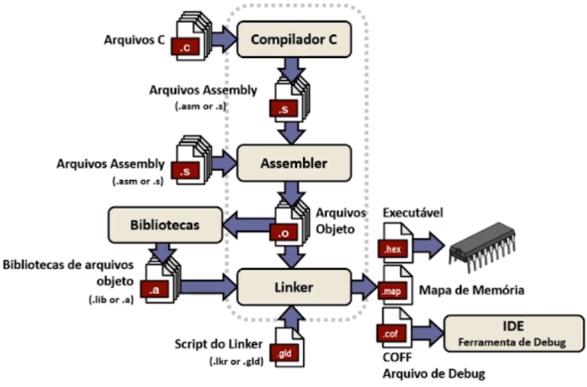

# Microgênios - Linguagem C (Padrão ANSI)

## Testes Lógicos e Fluxo de Compilação

### 1. Exercício - Teste Lógico

* Operadores Relacionais

Diga se as seguintes expressões são verdadeiras ou falsas:

10 > 5: Verdadeiro

5 > 10: Falso

5 == 6: Falso

5 != 6: Verdadeiro

2 <= 1: Falso

0 < (10 > 5): Verdadeiro

0 < 10 > 5: Falso

NOTA:

* A precedência NORMALMENTE é da esquerda para a direita.

* SEMPRE o que estiver entre parênteses é executado primeiro.

* Operadores Lógicos

Diga se as seguintes expressões são verdadeiras ou falsas:

((10 > 5) || (5 < 6)): Verdadeiro

((5 > 10) && (5 == 5)): Falso

(!(5 == 6)): Verdadeiro

((5 != 6) || (!(5 == 6))): Verdadeiro

(!((2 >= 1) && (1))): Falso

(!(5 <= 4)): Verdadeiro

((5 < 10) && (!(0))): Verdadeiro

* Operadores Booleanos

Diga se as seguintes expressões são verdadeiras ou falsas:

10101010 & 01010101: 00000000

10101010 | 01010101: 11111111

10101010 & (~01010101): 10101010

10101010 & (!01010101): 00000000

00000001 << 4: 00010000

01010101 >> 1: 00101010

10101010 & (01010101 << 1): 10101010

### 2. Fluxo de Compilação de Programas em C

* Sumário do Curso

História e introdução a linguagem C
Variáveis
Operadores
Tomada de decisão
Laços de repetição
Estrutura básica do programa em C
Matrizes
Função
Vetores e ponteiros
Diretivas de compilação

* História de Linguagem C - A Evolução

* Criada por Dennis Ritchie e por Brian W. Kernighan no Laboratório da Bell em 1972.

* Inicialmente linguagem BCPL.

* Linguagem B.

* Linguagem C.

* Linguagem C ANSI (Virou Padrão).

* Linguagem C++ (Orientado a Objeto).

* Linguagem C# e Java.

* Diferenças entre Assembly e C

* Linguagem Assembly: linguagem interpretada. Código gerado possui menor quantidade de bytes.

* Linguagem C: linguagem compilada. Código gerado possui maior quantidade de bytes.

* Gerando um arquivo hex



## Estudo Aprofundado de Variáveis

### 3. Tipos de Variáveis

```c
// Cálculo da área do círculo

// Diretivas de processamento
#include <stdio.h> // arquivo de cabeçalho

#define PI 3.14159 // declaração de constante

// função principal
void main(void) {
    // declarações de variáveis
    float radius, area;

    // calcular area do circulo
    radius = 12.0;

    area = PI * radius * radius; // processamento

    // declaração de saída
    printf("Area = %f", area);
}
```

* Variáveis

* Definição: variável é o nome que é dado à uma posição de memória usada para armazenar dados do programa.

* A variável pode ser vista como uma caixa que guarda os dados usados em seu programa.

```c
int variavel;

variavel = 5;
```

* Tipos de dados

| Tipo   | Descrição               | Bits |
| ---    | ----------------------- | ---- |
| char   | caractere               | 8    |
| int    | inteiro                 | 16   |
| float  | ponto flutuante - reais | 32   |
| double | ponto flutuante - reais | 64   |

O tamanho do int varia de acordo com o compilador.

* MPLAB-C30 int é 16-bits.
* MPLAB-C18 int é 16-bits.
* CCS PCB, PCM & PCH int é 8-bits.
* Hi-Tech PICC int é 16-bits.
* MikroC int é 16-bits.
* Keil (8051) int é 16-bits.

* Tipos de dados - Modificadores (unsigned, signed, short, long)

| Tipo de modificador         | Min      | Max           | Bits |
| -------------------         | -----    | ---           | ---- |
| unsigned char               | 0        | 255           | 8    |
| char, signed char           | -128     | 127           | 8    |
| unsigned short int          | 0        | 65535         | 16   |
| short int, signed short int | -32768   | 32767         | 16   |
| unsigned int                | 0        | 65535         | 16   |
| int, signed int             | -32768   | 32767         | 16   |
| unsigned long int           | 0        | $2^{32} - 1$  | 32   |
| long int, signed long int   | $-2{31}$ | $2^{31} - 1$  | 32   |
| unsigned long long int      | 0        | $2^{64} - 1$  | 64   |
| long long int               | $-2{63}$ | $2^{63} - 1$  | 64   |
| signed long long int        | $-2{63}$ | $2^{63} - 1$  | 64   |

### 4. Declarações de Variáveis Locais

* Classes de armazenamento

    Informam ao compilador como ele deve armazenar e fazer o acesso às variáveis. Abaixo estão listados as classes de armazenamento.

    const
    auto
    register
    static
    volatile

```c
// Comando para compilar: gcc -Wall -o exemplo1 exemplo1.c
// Comando para executar: ./exemplo1

#include <stdio.h>

int main (void) {
    unsigned char a;
    unsigned int b;
    float c;
    double d;
    long double e;

    printf("CHAR         = %zu bytes\n", sizeof(a));
    printf("INT          = %zu bytes\n", sizeof(b));
    printf("FLOAT        = %zu bytes\n", sizeof(c));
    printf("DOUBLE       = %zu bytes\n", sizeof(d));
    printf("LONG DOUBLE  = %zu bytes\n", sizeof(e));
  
    return 0;
}
```

```c
// Comando para compilar: gcc -Wall -o exemplo2 exemplo2.c
// Comando para executar: ./exemplo2

#include <stdio.h>

int main (void) {
    unsigned int a;
    unsigned short int b;
    unsigned long int c;
    unsigned long long int d;

    printf("INT             = %zu bytes\n", sizeof(a));
    printf("SHORT INT       = %zu bytes\n", sizeof(b));
    printf("LONG INT        = %zu bytes\n", sizeof(c));
    printf("LONG LONG INT   = %zu bytes\n", sizeof(d));
    
    return 0;
}
```

```c
// Comando para compilar: gcc -Wall -o exemplo3 exemplo3.c
// Comando para executar: ./exemplo3

#include <stdio.h>

unsigned int Soma(unsigned char x, unsigned char z) {
    return x + z;
}

int main (void) {
    unsigned int result = Soma(200, 56);
    printf("Soma: %d \n", result); 
    return 0;
}
```

### 5. Protótipos de Função

O **protótipo de função**, também conhecido como **cabeçalho da função** ou **alusão da função**, é uma **declaração** que estabelece a interface de uma função sem revelar sua implementação. Em sua essência, ele informa ao compilador o **nome da função**, o **tipo do valor que ela retorna** e os **tipos dos seus parâmetros**, finalizando com um ponto e vírgula (`;`).

A utilização de protótipos de função é uma prática fundamental na programação em C e em linguagens similares, oferecendo diversas vantagens:

* **Propósito e Verificação pelo Compilador**:

* É **obrigatório** declarar o protótipo de uma função antes que ela seja chamada no programa.
* O compilador utiliza o protótipo para realizar **verificações cruciais em tempo de compilação**, prevenindo erros que seriam mais difíceis de depurar em tempo de execução.
* Ele verifica se o **cabeçalho da função** (sua definição) corresponde ao seu protótipo.
* Garante que a **chamada da função** contém o número e os tipos corretos de argumentos, na ordem esperada.
* Verifica se o **valor de retorno** da função é compatível com o contexto em que é utilizado (por exemplo, se uma função `void` não é atribuída a uma variável).
* Permite a **conversão implícita** de argumentos para os tipos especificados nos parâmetros, quando apropriado, e sinaliza erros se a conversão não for permitida.

* **Sintaxe e Componentes**:
* A forma geral do protótipo é: `<tipo_do_retorno> <nome_da_função> (<lista_de_parâmetros>);`.
* A **lista de parâmetros** deve especificar o tipo de cada variável, mesmo que os nomes das variáveis sejam opcionais. Contudo, é uma boa prática manter os nomes para fins de documentação e clareza do código.
* Para funções que não retornam valor, o `<tipo_do_retorno>` é **`void`**.
* Se uma função não aceita parâmetros, a palavra-chave **`void`** deve ser colocada entre os parênteses na lista de parâmetros.

* **Posicionamento no Código**:
* Os protótipos são geralmente colocados no **início do arquivo fonte**, logo após as diretivas `#include`, ou em **arquivos de interface (`.h`)**.
* Definir as funções em qualquer ordem é possível graças à declaração explícita dos protótipos.

* **Modularização e Reutilização**:
* Os protótipos contribuem para a **modularização** do código, permitindo que as funções sejam definidas em arquivos separados e compiladas independentemente.
* Isso torna o programa **mais compreensível e modificável**, pois os detalhes de implementação podem ser "escondidos" dos módulos que utilizam a função.
* Facilita a **reutilização de código**, uma vez que um programa pode ser construído a partir de pequenos blocos de código (funções) com tarefas específicas e bem definidas.

* **Parâmetros Específicos**:
* Quando um **vetor ou matriz** é passado como parâmetro para uma função, ele é declarado no protótipo apenas com colchetes vazios (`[]`). Internamente, o nome do vetor ou matriz é tratado como um **ponteiro** para seu primeiro elemento.
* É possível declarar o tamanho do vetor explicitamente no protótipo, mas o tamanho é irrelevante para a definição da função.
* Para funções que recebem **ponteiros para funções** como parâmetros, o protótipo da função que recebe o ponteiro deve incluir a declaração completa do ponteiro para função, incluindo seu tipo de retorno e lista de parâmetros. Isso é crucial para a criação de **códigos genéricos**.

Em resumo, o protótipo de função é uma **ferramenta essencial** em C que **define a interface** de uma função, capacitando o compilador a realizar **verificações de tipo e sintaxe** em tempo de compilação, o que é fundamental para a **robustez e modularidade** de programas complexos.

```c
// Comando para compilar: gcc -Wall -o exemplo4 exemplo4.c
// Comando para executar: ./exemplo4

#include <stdio.h>

unsigned int count = 10; // variável global

// protótipo de função
unsigned int Soma(unsigned char x, unsigned char z);
int Divide(int x, int z);

int main (void) {
    unsigned int result = Soma(200, 56);
    printf("Soma: %d \n", result); 
    printf("Divisão: %d \n", Divide(100, 50));
    printf("Divisão somado com count: %d \n", Divide(100, 5) + count); // Teste de divisão por zero
    return 0;
}

unsigned int Soma(unsigned char x, unsigned char z) {
    return x + z;
}

int Divide(int x, int z) {
    if (z == 0) {
        printf("Erro: Divisão por zero.\n");
        return -1; // Retorna -1 em caso de erro
    }
    return x / z;
}

```

### 6. Alocação de Variáveis em Memória RAM

### 7. Variável Local Static

### 8. Organização de Projetos em C com Multifolhas

### 9. Variável Global Static

### 10. Variáveis Const

### 11. Variável Volatile

### 12. Variável Register

## Strings, Matrizes e Ponteiros

### 13. Introdução a Strings

### 14. Introdução a Matrizes e Ponteiros

### 15. Redefinindo tipos de dados via typedef

### 16. Trabalhando com Strings (Matrizes e Ponteiros)

### 17. Problemas com Invasão de Endereços de Memória

## Struct e Union

### 18. Introdução as Structs

### 19. Inicialização das Structs

### 20. Structs Encadeadas

### 21. Alinhamento de Structs

### 22. Ponteiro de Estrutura

### 23. Union em C
